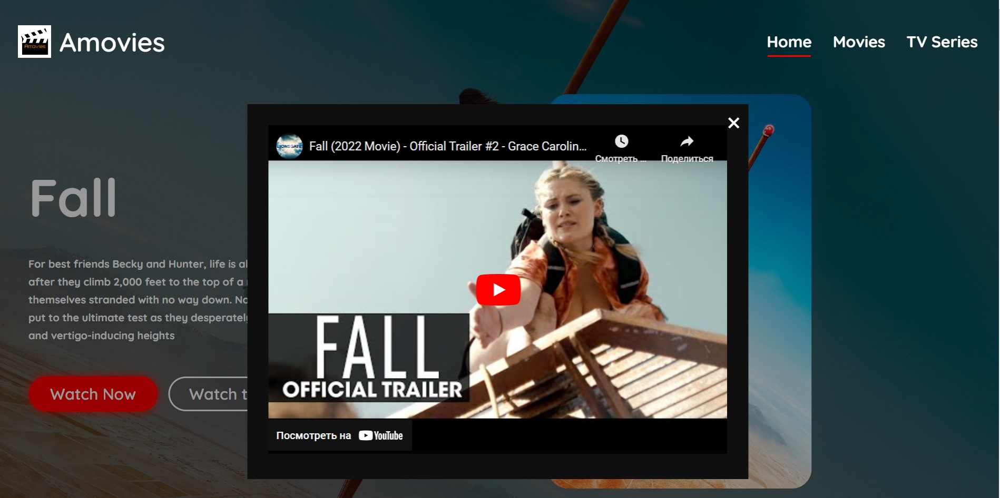
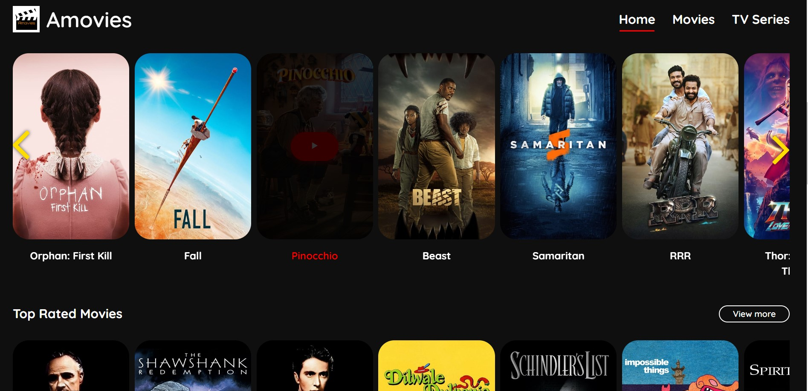
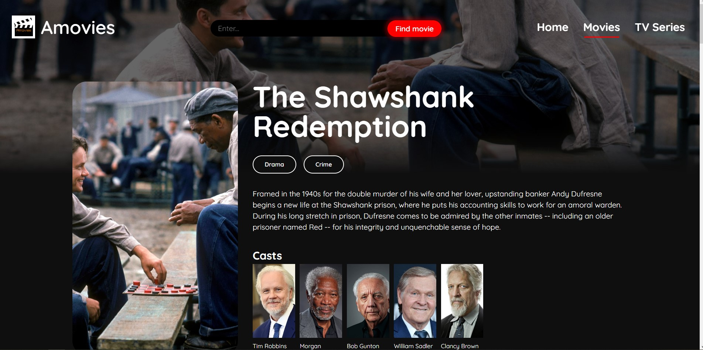
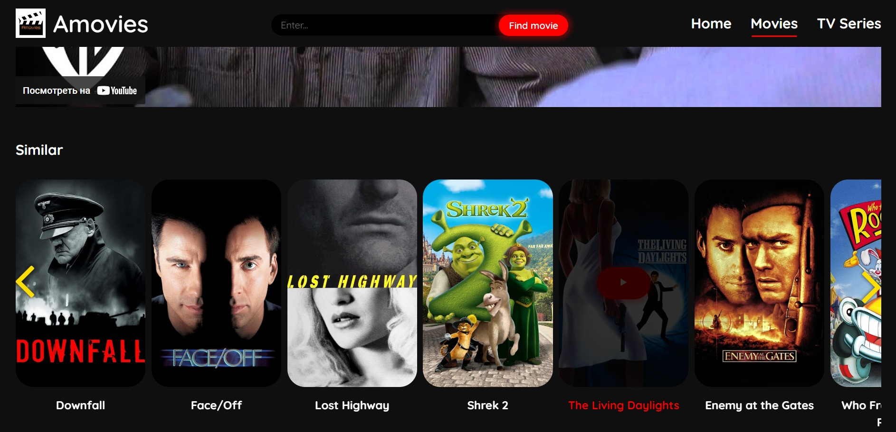
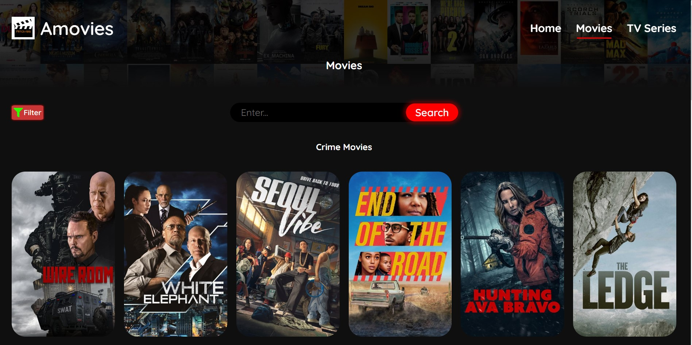
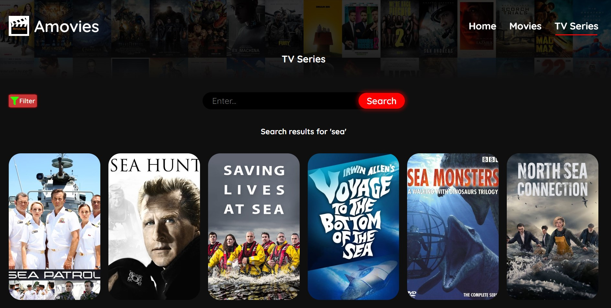
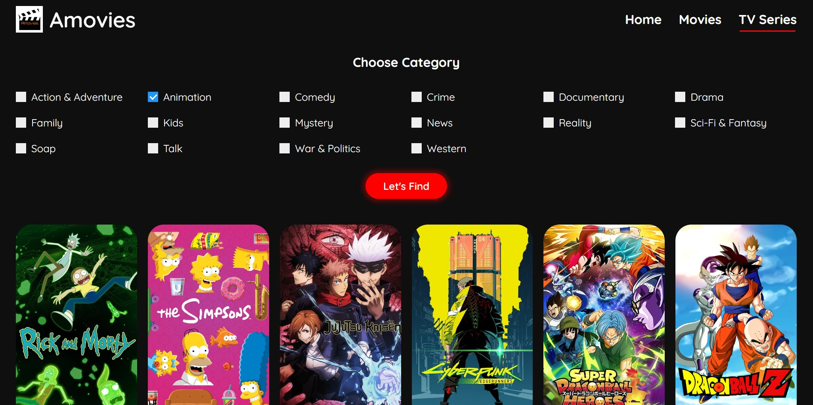
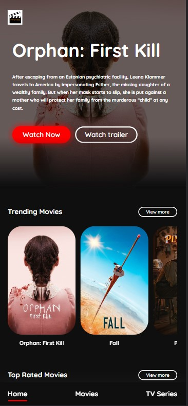

<h1 align='center'>Movies app</h1> 

<h2 align='center'><a href='https://movies-react-app-green.vercel.app' target='_blank'> Deployed Project</a></h2> 

## **Description**

 
This React app is a fully animated Movie catalog with applied adaptive design. For filling its content I've utilized TMDB API.
 

In the Hero section of the Home page you can watch a trailer of some popular product or get to the Details page by clicking 'Watch now'.

 
If you scroll down you would find Trending and Top Rated movies and TV series.

By clicking on a movie you'll be directed to Detail page where you'd find all the information about it, trailers as well as similar products.

 
You can also make a search or find needed category from the deatil page itself by clicking on the specific category. For instance, if we click on 'Crime' from the image above we will be directed to another page with displayed results:

 
In this app i also implemented search and filter options. Below are respective images 

 
This app is also fully adaptive 

## **Tech stack:**
<ul>
<li>HTML</li>
<li>SASS (SCSS)</li>
<li>JavaScript</li>
<li>React</li>
<li>Axios</li>
<li>The Movie Database API</li>
<li>Framer Motion</li>
</ul>

 
 While working on this project, I greatly improved my understanding of React, REST API, SASS pre-processor and Framer Motion. 

